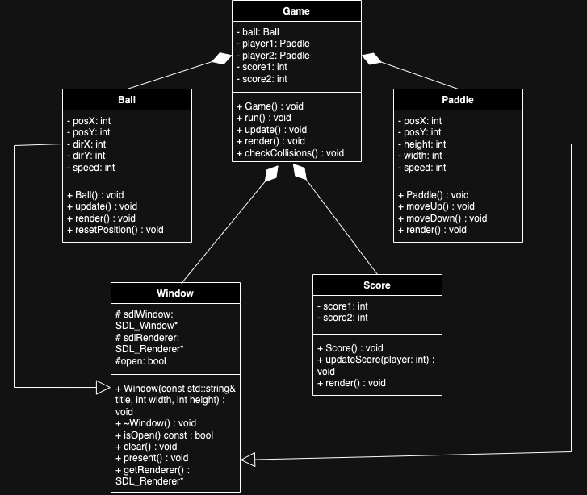

# Ping Pong Proyect

This project involves the development of a Ping-Pong game in C++, where I will implement fundamental concepts of object-oriented programming (OOP) such as collision detection, loops, and class structures. Additionally, basic laws of physics will be applied to simulate the ball’s speed and direction, accounting for collisions between the ball and the paddle, as well as bounces off the horizontal walls.

The game simulates a Ping Pong match between two players, which can either be two players or a player against an AI (if implemented). The objective is to keep the ball in play, returning it accurately to the opposite side of the table while preventing it from falling off the playing field. A scoreboard will keep track of points, with the first player to reach 10 points declared the winner.

This project not only aims to create an entertaining and engaging game but also serves as an educational tool to improve the user's reaction time and ability to calculate precise angles quickly. The game mechanics will challenge players to develop better timing and hand-eye coordination, simulating real-world Ping Pong gameplay.

The use of the CMakeLists.txt is optional, the program should run without it.
In the Config.h you can change the velocity of the ball and the paddles. 
One player plays with "W" and "S" and the other with the up and down arrow

